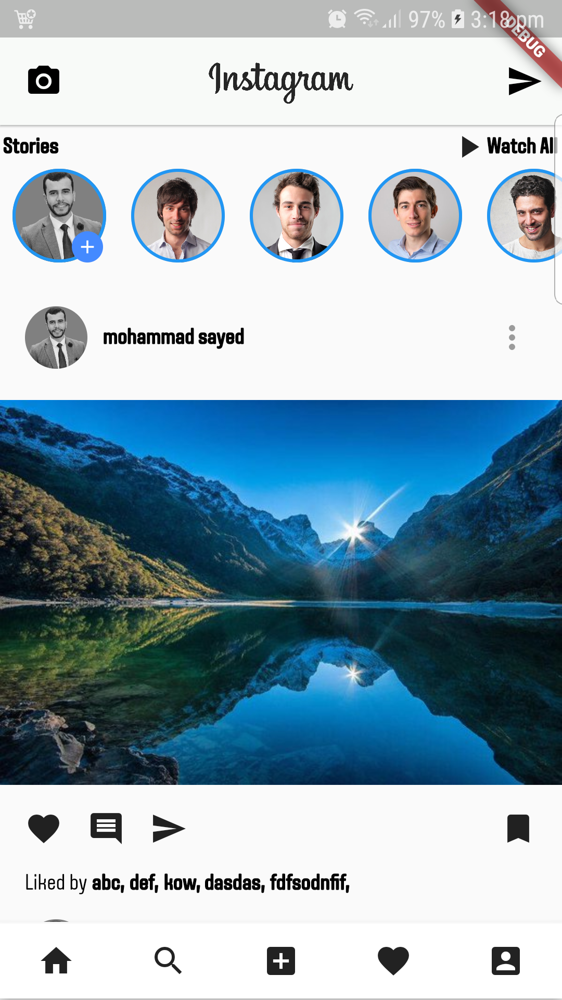
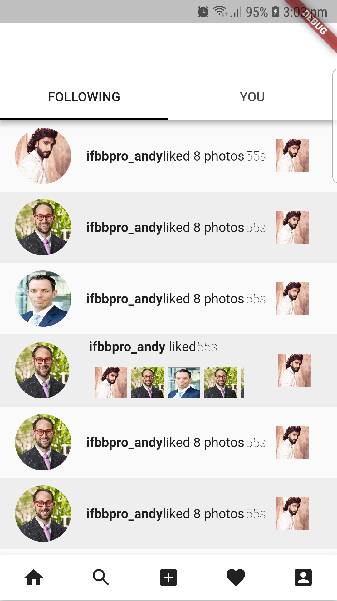
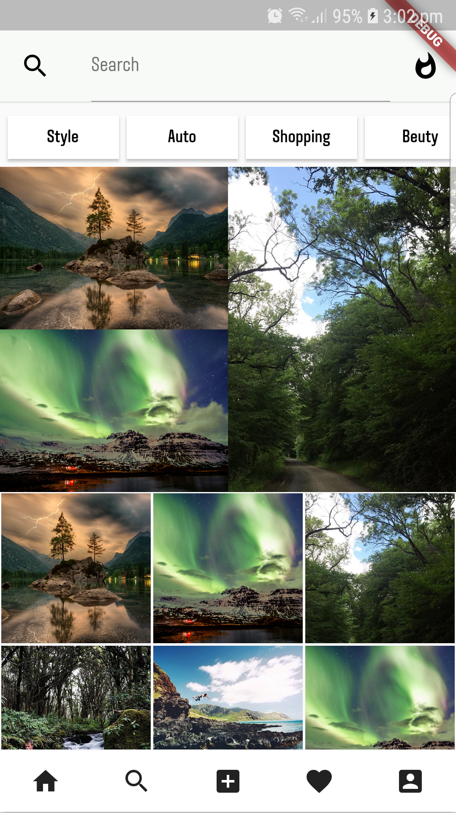
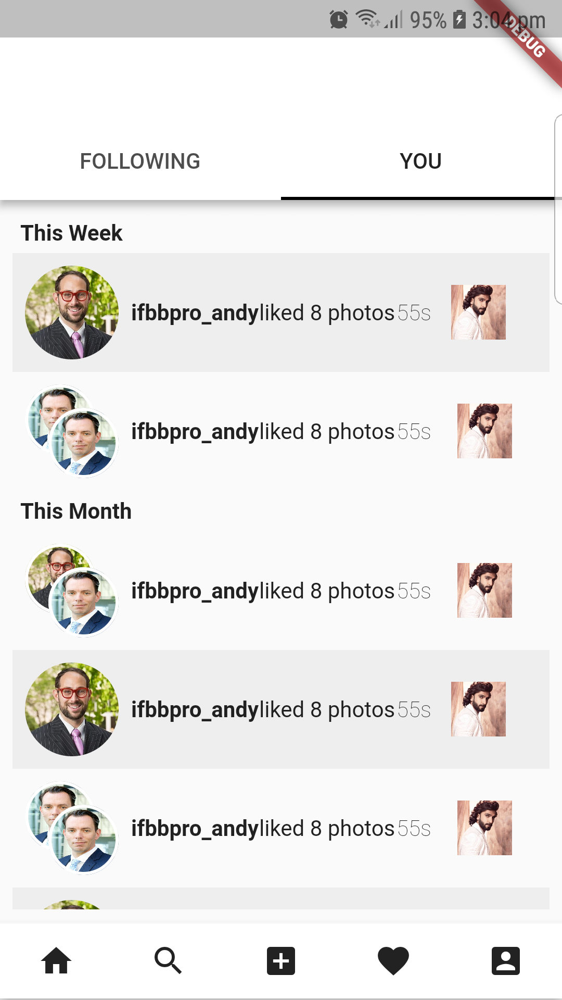
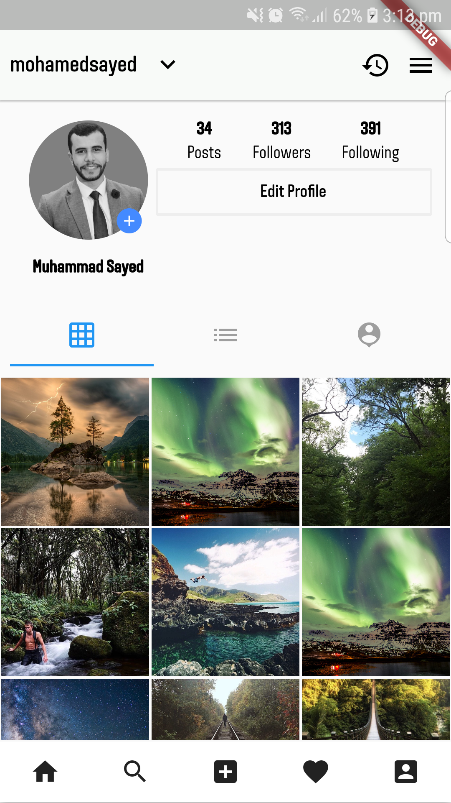
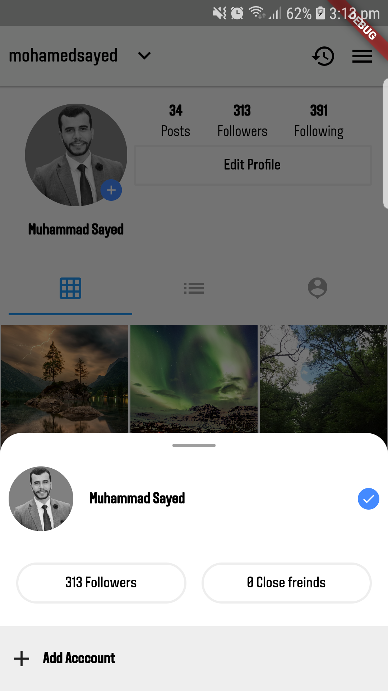

# flutter_instagram_ui_clone

### Some Screenshots

<table>
  <tr>
    <th></th>
    <th></th>
  
   <tr>
     <tr>
      <td></td>
      <td></td>
   <tr>
   <tr>
     <td></td>
     <td></td>
   <tr>
    <tr>
     <td></td>
     <td></td>
   <tr>
  
</table>
 

A new Flutter project.

## Getting Started

For help getting started with Flutter, view our online
[documentation](https://flutter.io/).
